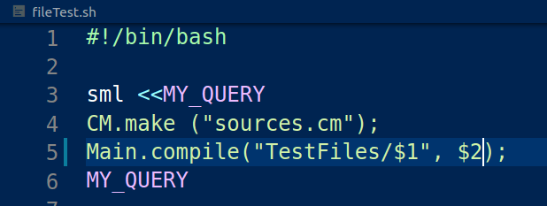

 Tiger To RISC V Compiler 
======================

This is [Tiger](https://www.cs.princeton.edu/~appel/modern/ml/) to RISC V compiler, written in Standard ML.

Beyond what is already mentioned in the book, my Tiger
specification includes abstractly two more things:-

1.  Real number support.

2.  Objective functionality support.

Real numbers enjoy first class support just like integers, strings and
can be used exactly as integers.

Grammar Additions
-----------------

$exp \rightarrow$ *real-literal*

$\rightarrow$ ***new** class-id*

$\rightarrow$ *lvalue.id()*

$\rightarrow$ *lvalue.id(exp{, exp})*

*dec* $\rightarrow$ *classdec*

*classdec* $\rightarrow$ ***class** class-id **extends** class-ids
{{classfield}}*

*class-ids* $\rightarrow$ *id{, id}*

*classfield* $\rightarrow$ *vardec*

*classfield* $\rightarrow$ *fundecs*

Specifications For Objective Tiger
----------------------------------

-   To simplify implementation, all declared *classes* (irrespective of
    being in different environment) should have unique name.

-   *vardec*, *fundecs* could be *overridden* by the subclass but the
    types should be preserved as it has to be backward compatible.

-   *vardec*'s within the class shall not use this subclass fields for
    its initialisation as there is no self to fetch them.

-   As evident from grammar specification, there is no \"method\" but
    our usual \"functions\" and thus mutually recursive methods are
    supported.

-   Type casting of a subclass to its superclass is supported both in
    variable assignment and as in function argument.

-   There is also a support to check whether an object 'x' is of its
    original class 'X' or any of the superclass of 'X' via
    *ISTYPE(objectName, ClassName)*. *ClassName* is to be given as a
    *string* whereas the other parameter shall be *var*.

-   Multiple inheritance is supported but the classes to be extend
    should be *disjoint* and thus should have no field in common.

Compile Time Arguments
--------------------------

Since there are so many choices offered to a user when using this
compiler. For instance:-

1.  Option to give filename to print IR Tree at. Flag = `ir`. Default =
    `TextIO.stdOut`.

2.  Option to give filename to print instructions before register
    allocation at. Flag = `ba`. Default = `TextIO.stdOut`.

3.  Option to choose which string algorithm to be used for displaying
    suggestions in case of mistyped word. Flag = `sa`. Default = `0`
    (i.e. Levenshtein algorithm).

I have implemented feature for users to give compile time flags. Note: I
mention \"flags\", thus user has an option to not define it, in which
case default flag will be taken. See image below for an example usage.

How To Compile?
---------------

One needs to first *make* the files visible in *sources.cm* as
`CM.make ("sources.cm")` then simply compile the file using the command
(in sml), `Main.compile(FilePath, Arguments)`. For an example please see
the above subsection and aswell the file `fileTest.sh`, contents of
which are listed below. 
.

One can now run the compiled RISC V code using [RARS](https://github.com/TheThirdOne/rars) like `java -jar rars1_3_1.jar sm nc TestFiles/filename.tig.s`.

Documentation?
--------------

See [Report](BTP_report/template/btp_report.pdf).