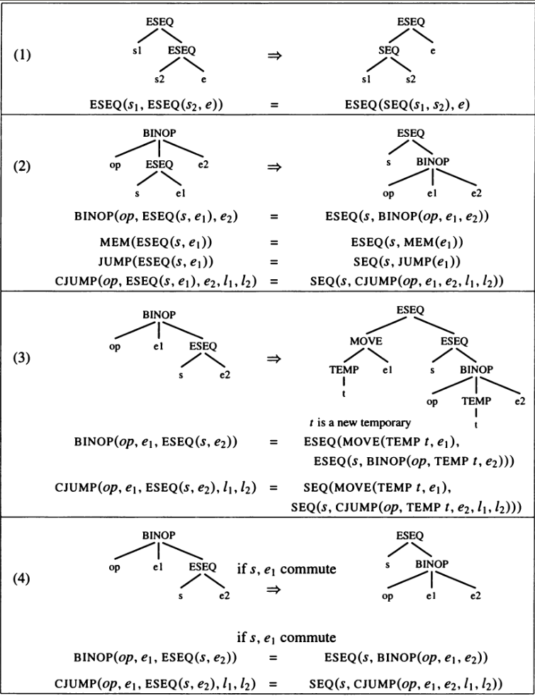

## Abstract

It's useful to be able to evaluate the sub-expressions of an expression in any  order.  If  tree  expressions  did  not  contain  `ESEQ`  and  `CALL`  nodes, then the order of evaluation would not matter.


### Why `CALL` nodes are an issue?

In actual implementation, `CALL` nodes will return value in the same register (`a0` in case of RISC V). Thus in an expression like `BINOP(PLUS, CALL(...), CALL(...))`; the second call will overwrite the `a0` register before the `PLUS` can be executed.

Remedy is to do the transformation; `CALL(fun, args) -> ESEQ(MOVE(TEMP t, CALL(fun, args)), TEMP t)`

### Why `ESEQ` nodes are an issue?

Clearly in case of simple `ESEQ(s, e)`, statement `s` can have direct or side effects on an expression `e`.

Remedy is as shown in below figure (basically lifting them higher and higher until they become `SEQ` nodes).




The transformation is done in three stages: First, a tree is rewritten into a  list  of  canonical  trees  without  `SEQ`  or  `ESEQ`  nodes;  then  this  list  is grouped  into  a  set  of  basic  blocks,  which  contain  no  internal  jumps  or labels;  then  the  basic  blocks  are  ordered  into  a  set  of  traces  in  which every `CJUMP` is immediately followed by its false label. This will become clear when seeing the below well documented code.

File: [canon.sml](https://www.github.com/sourabh2311/btp/tree/master/Compiler/canon.sml)
```sml
signature CANON = 
sig
  val linearize : Tree.stm -> Tree.stm list
    (* 
      From an arbitrary Tree statement, produce a list of cleaned trees satisfying the following properties:
      1.  No SEQ's or ESEQ's
      2.  The parent of every CALL is an EXP(..) or a MOVE(TEMP t,..)
    *)

  val basicBlocks : Tree.stm list -> (Tree.stm list list * Tree.label)
    (* 
      From a list of cleaned trees, produce a list of basic blocks satisfying the following properties:
      1. and 2. as above;
      3.  Every block begins with a LABEL;
      4.  A LABEL appears only at the beginning of a block;
      5.  Any JUMP or CJUMP is the last stm in a block;
      6.  Every block ends with a JUMP or CJUMP;
      Also produce the "label" to which control will be passed upon exit.
    *)

  val traceSchedule : Tree.stm list list * Tree.label -> Tree.stm list
    (* 
      From a list of basic blocks satisfying properties 1-6, along with an "exit" label, produce a list of stms such that:
      7. Every CJUMP(_, t, f) is immediately followed by LABEL f. The blocks are reordered to satisfy property 7; also in this reordering as many JUMP(T.NAME(lab)) statements as possible are eliminated by falling through into T.LABEL(lab).
    *)
  (* Note that after we get Intermediate Representation Tree, we would first call linearize then we will get basic blocks using basicBlocks and then we will call traceSchedule *)
end

structure Canon : CANON = 
struct

  structure T = Tree

  fun linearize(stm0: T.stm) : T.stm list =
  let
    (* 
      An identifier can actually be declared infix even before it refers to a specific function:
      infix pow
      fun x pow y = Math.pow (x, y)
      val eight = 2.0 pow 3.0 
    *)
    (* Below we are defining '%' as an infix operator where we are joining two statements with a minor reduction *)
    infix %
    fun (T.EXP(T.CONST _)) % x = x
      | x % (T.EXP(T.CONST _)) = x
      | x % y = T.SEQ(x, y)

    (* To check whether a statement and an expression commutes or not *)
    (* We cannot always tell if two expressions commute. For example, whether MOVE(MEM(x), y) commutes with MEM(z) depends on whether x = z, which we cannot always determine at compile time. So we conservatively approximate whether statements commute, saying either "they definitely do commute" or "perhaps they don't commute." *)
    fun commute(T.EXP(T.CONST _), _) = true
      | commute(_, T.NAME _) = true
      | commute(_, T.CONST _) = true
      | commute _ = false

    val nop = T.EXP(T.CONST 0)

    (* The reorder function takes a list of expressions and returns a pair of (statement, expression-list). The statement contains all the things that must be executed before the expression-list. As shown in these examples, this includes all the statement-parts of the ESEQs, as well as any expressions to their left with which they did not commute. When there are no ESEQs at all we will use EXP(CONST 0), which does nothing, as the statement. *)
    fun reorder ((e as T.CALL _ ) :: rest) =
    let 
      val t = Temp.newtemp()
    in 
      reorder(T.ESEQ(T.MOVE(T.TEMP t, e), T.TEMP t) :: rest)
    end
      | reorder (a :: rest) =
    let 
      val (stms, e) = do_exp a
      val (stms', el) = reorder rest
    in 
      if commute(stms', e) then (stms % stms', e :: el)
      else 
        let 
          val t = Temp.newtemp()
        in 
          (stms % T.MOVE(T.TEMP t, e) % stms', T.TEMP t :: el)
        end
    end
      | reorder nil = (nop, nil)

    (* reorder_stm takes two arguments - a list l of subexpressions and a build function. It pulls all the ESEQ's out of the l, yielding a statement s1 that contains all the statements from ESEQ's and a list l' of cleaned up expressions. Then it makes SEQ(s1, build(l'))  *)

    (* reorder_exp(l, build) is similar, except that it returns a pair (s, e) where s is a statement containing all the side effects pulled out of l, and e is build(l'). To pull all the ESEQs from l, the functions reorder_stm and reorder_exp must call do_exp recursively. *)
    
    and reorder_stm(el, build) = 
        let 
          val (stms, el') = reorder (el)
        in stms % build(el')
        end

    and reorder_exp(el, build) = 
        let 
          val (stms, el') = reorder el
        in (stms, build el')
        end

    and do_stm(T.SEQ(a, b)) = do_stm a % do_stm b
      | do_stm(T.JUMP(e, labs)) = reorder_stm([e], fn [e] => T.JUMP(e, labs))
      | do_stm(T.CJUMP(p, a, b, t, f)) = reorder_stm([a, b], fn [a, b] => T.CJUMP(p, a, b, t, f))
      (* Here do_stm has recognised the pattern which is the desired one, hence, there is no need to call reorder on this CALL node. *)
      | do_stm(T.MOVE(T.TEMP t, T.CALL(e, el))) = reorder_stm(e :: el, fn e :: el => T.MOVE(T.TEMP t, T.CALL(e, el)))
      | do_stm(T.MOVE(T.TEMP t, b)) = reorder_stm([b], fn [b] => T.MOVE(T.TEMP t, b))
      | do_stm(T.MOVE(T.MEM e, b)) = reorder_stm([e, b], fn [e, b] => T.MOVE (T.MEM e, b))
      | do_stm(T.MOVE(T.ESEQ(s, e), b)) = do_stm(T.SEQ(s, T.MOVE(e, b)))
      | do_stm(T.EXP(T.CALL(e, el))) = reorder_stm(e :: el, fn e :: el => T.EXP(T.CALL(e, el)))
      | do_stm(T.EXP e) = reorder_stm([e], fn [e] => T.EXP e)
      | do_stm s = reorder_stm([], fn[] => s)

    and do_exp(T.BINOP(p, a, b)) = reorder_exp([a, b], fn [a, b] => T.BINOP(p, a, b))
      | do_exp(T.MEM(a)) = reorder_exp([a], fn [a] => T.MEM(a))
      | do_exp(T.ESEQ(s, e)) = 
        let 
          val stms = do_stm s
          val (stms', e) = do_exp e
        in (stms % stms', e)
        end
      | do_exp(T.CALL(e, el)) = reorder_exp(e :: el, fn e :: el => T.CALL(e, el))
      | do_exp e = reorder_exp([], fn [] => e)

    (* linear gets rid of the top-level SEQ's, producing a list *)
    fun linear(T.SEQ(a, b), l) = linear(a, linear(b, l))
      | linear(s, l) = s :: l

  in (* body of linearize *)
    linear(do_stm stm0, nil)
  end

  type block = T.stm list

  (* This function will simply return the list of basic blocks (which in turn is a list of statements) *)
  fun basicBlocks stms = 
  let 
    (* "done" is used to mark the end (see traceSchedule) *)
    val done = Temp.newlabel()
    fun blocks((head as T.LABEL _) :: tail, blist) =
    let 
      fun next((s as (T.JUMP _)) :: rest, thisblock) = endblock(rest, s :: thisblock)
        | next((s as (T.CJUMP _)) :: rest, thisblock) = endblock(rest, s :: thisblock)
        | next(stms as (T.LABEL lab :: _), thisblock) = next(T.JUMP(T.NAME lab, [lab]) :: stms, thisblock)
        | next(s :: rest, thisblock) = next(rest, s :: thisblock)
        (* Atlast jumping to "done" *)
        | next(nil, thisblock) = next([T.JUMP(T.NAME done, [done])], thisblock)
  
      and endblock(stms, thisblock) = blocks(stms, rev thisblock :: blist)
      
    in 
      next(tail, [head])
    end
      | blocks(nil, blist) = rev blist
      | blocks(stms, blist) = blocks(T.LABEL(Temp.newlabel()) :: stms, blist)
  in  
    (blocks(stms, nil), done)
  end

  (* Used by traceSchedule to map all basic block's definition to that block *)
  fun enterblock(b as (T.LABEL s :: _), table) = Symbol.enter(table, s, b)
    | enterblock(_, table) = table

  (* Given [a_1, ..., a_n] to splitlast, it will return ([a1, ..., a_n-1], an) *)
  fun splitlast([x]) = (nil, x)
    | splitlast(h :: t) = 
      let 
        val (t', last) = splitlast t 
      in 
        (h :: t', last) 
      end

  (* b -> current basic block, rest -> remaining basic blocks *)
  fun trace(table, b as (T.LABEL lab :: _), rest) = 
  let 
    val table = Symbol.enter(table, lab, nil)
  in 
    case splitlast b of 
        (most, T.JUMP(T.NAME lab, _)) =>
          (case Symbol.look(table, lab) of 
              (* Thus we going the the neighbour, removing this useless jump condition *)
              SOME(b' as _ :: _) => most @ trace(table, b', rest)
            | _ => b @ getnext(table, rest))
      | (most, T.CJUMP(opr, x, y, t, f)) =>
          (case (Symbol.look(table, t), Symbol.look(table, f)) of 
                (* As we want the block to be followed by its false label *)
                (_, SOME(b' as _ :: _)) => b @ trace(table, b', rest)
                (* Thus false label doesn't exist which can be reduced to above case by swapping labels *)
              | (SOME(b' as _ :: _), _) => most @ [T.CJUMP(opr, x, y, f, t)] @ trace(table, b', rest)
                (* In this case, neither of the labels exist thus we invent a new false label *)
              | _ => 
                let 
                  val f' = Temp.newlabel()
		            in 
                  most @ [T.CJUMP(opr, x, y, t, f'), T.LABEL f', T.JUMP(T.NAME f, [f])] @ getnext(table, rest)
                end)
      | (most, T.JUMP _) => b @ getnext(table, rest)
     end

  and getnext(table, (b as (T.LABEL lab :: _)) :: rest) = 
      (case Symbol.look(table, lab) of 
          SOME(_ :: _) => trace(table, b, rest)
          (* As we delete labels from map, we can reach a case where this path is already covererd and hence can now be ignored. *)
        | _ => getnext(table, rest))
    | getnext(table, nil) = nil

  fun traceSchedule(blocks, done) = getnext(foldr enterblock Symbol.empty blocks, blocks) @ [T.LABEL done]

end
```