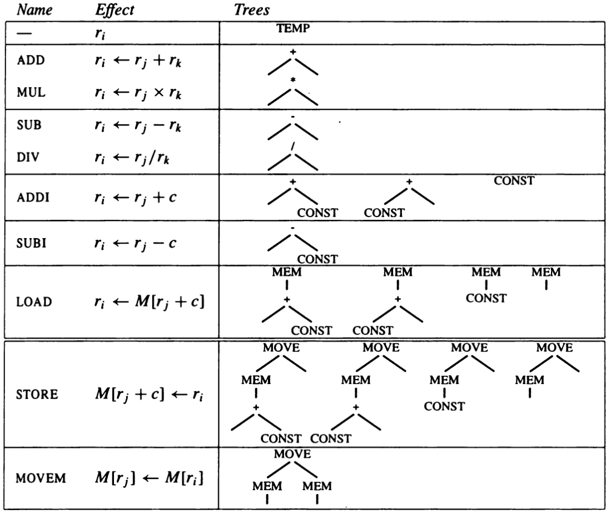
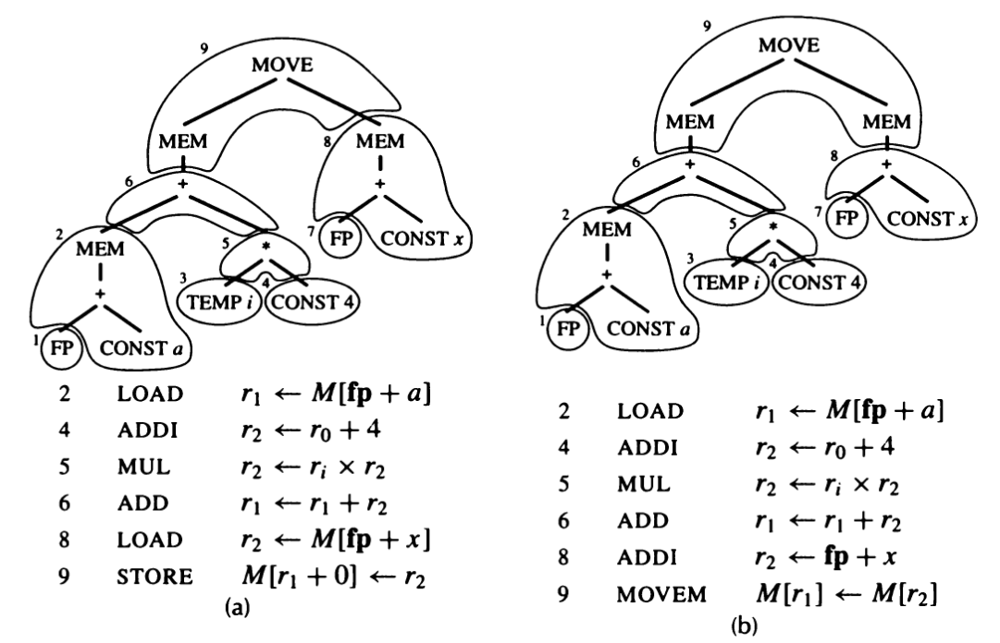

## Instruction Representation

Now that we have done Canonisation, our compiler will now call code generator. It will basically convert the body into assembly language code with the restriction that we will still be using temporaries instead of actual machine registers. In this form, source registers will be labelled `` `si`` and destination registers as `` `di``. So our each instruction would be represented as an operation string having these `` `si``, `` `di``'s where `` `si`` is indexed from `src` list, and `` `di`` are indexed from `dst` list. This is captured as `datatype instr` in [`assem.sml`](https://www.github.com/sourabh2311/btp/tree/master/Compiler/assem.sml). 

```sml
datatype instr = 
			OPER of {assem: string, dst: temp list, src: temp list, jump: label list option}
    | LABEL of {assem: string, lab: Temp.label}
    | MOVE of {assem: string,  dst: temp, src: temp}
```

An `OPER` holds an assembly-language instruction `assem`, a list of operand registers `src`, and a list of result registers `dst`. Either of these lists may be empty. Operations that always fall through to the next instruction have `jump = NONE`; other operations have a list of "target" labels to which they may jump (this list must explicitly include the next instruction if it is possible to fall through to it).

A `LABEL` is a point in a program to which jumps may go. It has an `assem` component showing how the label will look in the assembly-language program, and a `lab` component identifying which label-symbol was used.

A `MOVE` is like an `OPER`, but must perform only data transfer. Then, if the `dst` and `src` temporaries are assigned to the same register, the `MOVE` can later be deleted (as done in my register allocator).

## Code Generation

Finding the appropriate machine instructions to implement a given intermediate representation tree is the job of the instruction selection phase of a compiler.

We can express a machine instruction as a fragment of an IR tree, called a tree pattern as denoted in the figure below. Then instruction selection becomes the task of tiling the tree with a minimal set of tree patterns.



The very first entry is not really an instruction, but expresses the idea that a `TEMP` node is implemented as a register, so it can "produce a result in a register" without executing any instructions at all.

For each instruction, the tree-patterns it implements are shown. Some instructions correspond to more than one tree pattern; the alternate patterns are obtained for commutative operators (+ and *), and in some cases where a register or constant can be zero (`LOAD` and `STORE`). Here we abbreviate the tree diagrams slightly: `BINOP(PLUS, x, y)` nodes will be written as `+(x, y)`, and the actual values of `CONST` and `TEMP` nodes will not always be shown.

Consider the instruction `a[i] := x`. Two possible tilings for this instruction is shown in the diagram. (Remember that `a` is really the frame offset of the pointer to an array)



## Maximal Munch Algorithm

Suppose we could give each kind of instruction a cost. Then we could define an optimum tiling as the one whose tiles sum to the lowest possible value. An optimal tiling is one where no two adjacent tiles can be combined into a single tile of lower cost. If there is some tree pattern that can be split into several tiles of lower combined cost, then we should remove that pattern from our catalog of tiles before we begin. Every optimum tiling is also optimal, but not vice versa.

The algorithm for optimal tiling is called **Maximal Munch**. It is quite simple. Starting at the root of the tree, find the largest tile that fits. Cover the root node - and perhaps several other nodes near the root - with this tile, leaving several subtrees. Now repeat the same algorithm for each subtree. As each tile is placed, the corresponding instruction is generated. The  Maximal Munch algorithm generates the instructions in reverse order - after all, the instruction at the root is the first to be generated, but it can only execute after the other instructions have produced operand values in registers. The "largest tile" is the one with the most nodes. If two tiles of equal size match at the root, then the choice between them is arbitrary. Maximal Munch is quite straightforward to implement in ML. Simply write two recursive functions, `munchStm` for statements and `munchExp` for expressions. Each clause of `munchExp` will match one tile. The clauses are ordered in order of tile preference (biggest tiles first); ML's pattern-matching always chooses the first rule that matches.

This algorithm is implemented in the file [`codegen.sml`](https://www.github.com/sourabh2311/btp/tree/master/Compiler/codegen.sml)